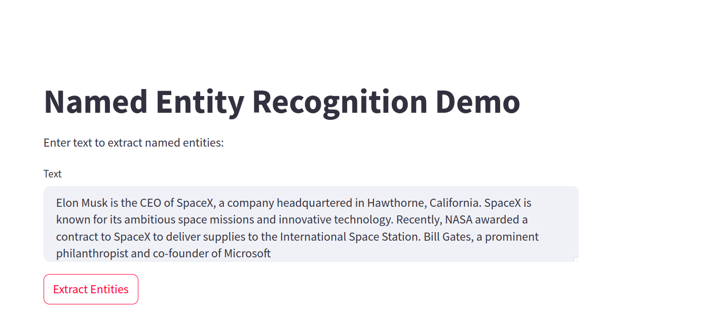
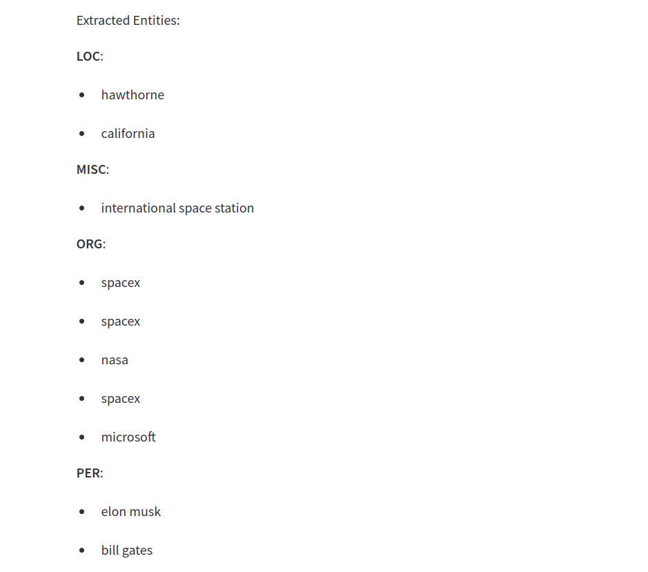

# NER Task

Machine learning model to detect the following entities from a given text
* Location
* Person
* Organization
* MISC

in this work some experiments is done by leveraging pretrained models by fine tuning them with CONLL2003 Dataset.

## structure

* `requirements.txt` all required packages are listed here
* `Dockerfile` a Dockerfile exist to package the source code with all required packages
* `EDA.ipynb` jupyter notebook for EDA.
* `mlruns` mlflow folder so it's possible to view all experiments arguments, metrics and artifacts.
* `/models` folder that contains the trained model and it's used in the api.
* `/app.py` that contains the Restful API that handle incoming requests for extraction.

## Instllation

1) Download the model from the following link `https://drive.google.com/drive/folders/1IMluU08N7Eipysuma936oNg4oAcFCbxA?usp=sharing`
put the model in `/models` directory and name the folder that contains tokenizer and weights `model`

2) to run the training cycle
`python trainin/trainer.py`

3) to run the Restful API use the dockerfile
`docker build -t ner_task .` for building the image
`docker run -it -p 8000:8000 ner_task` for running a container

4) to run the gui of mlflow
`mlflow ui` it will open the gui on port 5000

5) to run streamlit demo.
`pip install streamlit` to install streamlit.
`streamlit run streamlit.py` to open the demo page.

## Demo

### Using streamlit interface this is an example that has sent to API

### The results from the API
